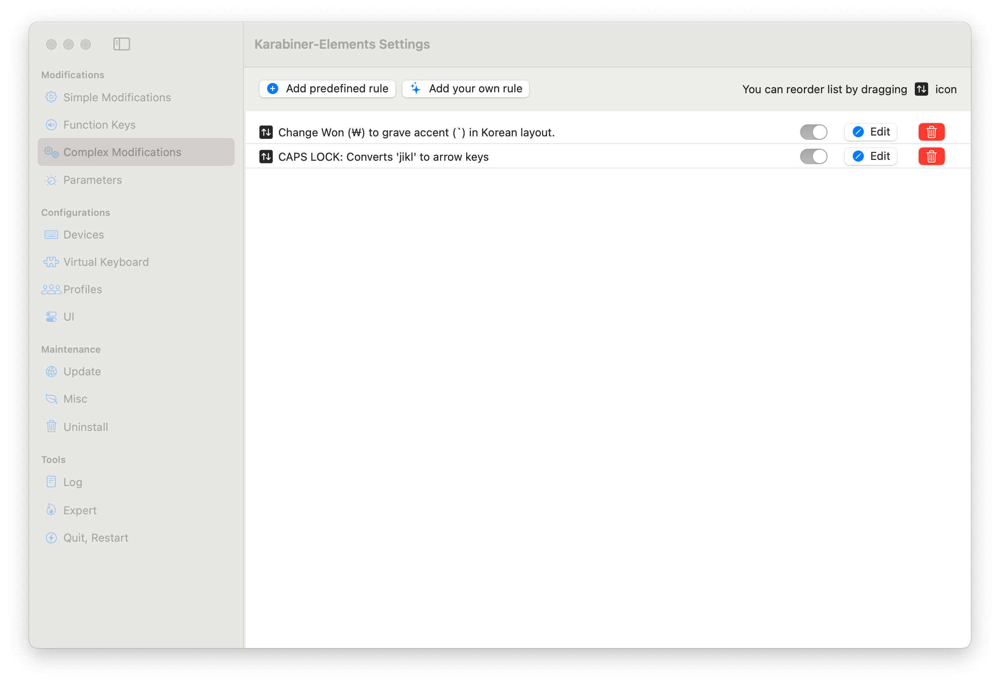

Karabiner-Elements > settings > complex modifications

아래 두 설정을 넣어주세요.

- [vim에 영감받은 jkli을 방향키로 쓰는 설정](./caps-lock-converts-jkli-to-arrow-keys.json)
- [한국어 키 배열일 때 원화(₩)대신 백틱(`) 입력하는 설정](./change-won-to-backtick-in-korean-layout.json)

설정을 넣어주세요.

